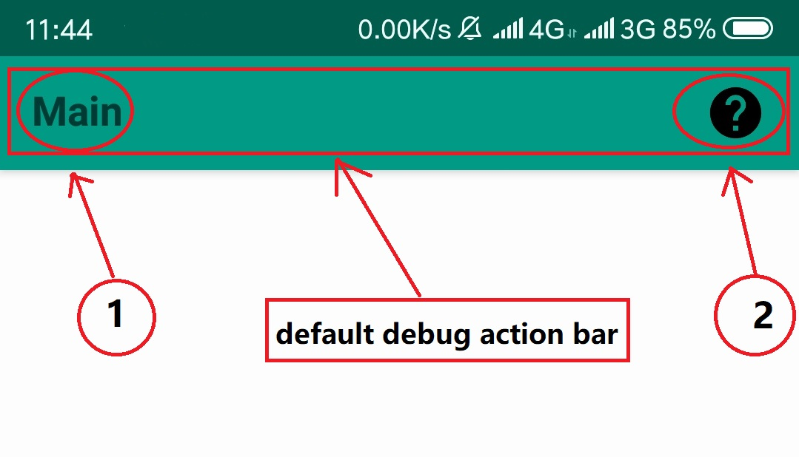

This labrary is developed to make a android project found upon the BasicActivity as parent.
The BasicActivity has the functions of set action bar,check permission and request permission and so on. 

If you are buildding a bebug project,you can use the default action bar <b><a href="src/main/java/com/hlm/basic/activity/MyActionBarActivity.java#L22">setMyActionBar()</a> </b> at <b>'MyActionBarActivity.java'.</b>

Of course,you can set your action bar with a <b>'View'</b> and calling <b><a href="src/main/java/com/hlm/basic/activity/MyActionBarActivity.java#L34">setMyActionBar(View bar)</a></b> <b>'MyActionBarActivity.java'.</b>,
and it will be current activity's action bar.(The 'View' is better as a 'LinearLayout' and its orientation="horizontal") 
Another function is to set the activity's title by 'setTitle(String title)',you can also use 'setMyActionBar(String title)' 
to load action bar and set title. 
You can 'setHelpListener(String help)' to give the help button on right side action bar,which click can show 'help' content 
to users.And 'setDefaultHelp(String help)' method is to define the default help content,which can be show all over the application's 
activity if the activity set help content as null or "".

If your project's max sdk version,that means you need to dynamicly request permissions for you application.
This is a complex step for developer,but now you can use the 'MyPermissionActivity' to use correspondent api to resolve 
the request permissions.Such one function as the following code:
<pre>
protected void request(Runnable runnable, String permission) {
    this.mRunnable = runnable;
    request(permission);
}
</pre>
This method can request permission you specify,and if is request successful,the runnable will be runned if it is not null.
When you maybe request permission,you will not opertion UI in runnable.In addition,just do everything you want to.

In theory,you need to extended the 'BasicActivity' for your own activities.Because 'BasicActivity.java' is include the whole 
basic function to develop your project's activity.
The basic function we provide will take effect until you call correspondent method,also given the correct parameters.
